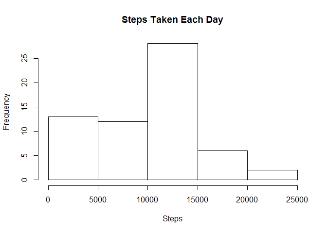
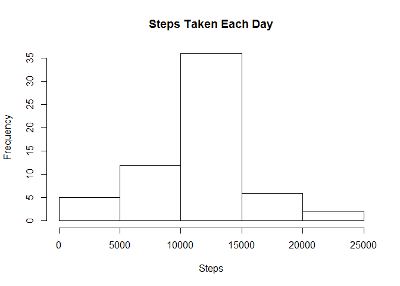
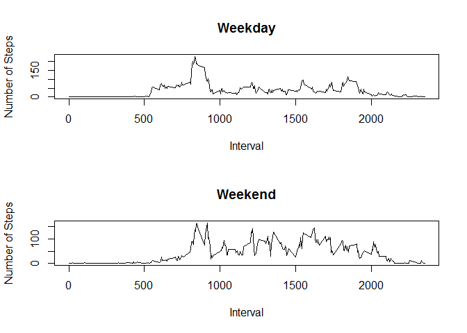

# Reproducible Research: Peer Assessment 1

## Loading and preprocessing the data

```r
data <- read.csv("activity.csv")

library(data.table)
```

```
## Warning: package 'data.table' was built under R version 3.2.5
```

```r
data = data.table(data)
```

## What is mean total number of steps taken per day?

```r
hdata <- aggregate(data$steps, by=list(Date=data$date), FUN=sum, na.rm = TRUE)
hist(hdata$x, xlab = "Steps", main = "Steps Taken Each Day")
```



```r
summary(hdata) #Mean and Median
```

```
##          Date          x        
##  2012-10-01: 1   Min.   :    0  
##  2012-10-02: 1   1st Qu.: 6778  
##  2012-10-03: 1   Median :10395  
##  2012-10-04: 1   Mean   : 9354  
##  2012-10-05: 1   3rd Qu.:12811  
##  2012-10-06: 1   Max.   :21194  
##  (Other)   :55
```

## What is the average daily activity pattern?

```r
plotdata <- data[, list(steps=sum(steps, na.rm = TRUE)), by=interval]
with(plotdata, plot(interval, steps, type="l"))
```


```r
data[which.max(data$steps)]
```

```
##    steps       date interval
## 1:   806 2012-11-27      615
```

## Imputing missing values

```r
sum(is.na(data$steps))
```

```
## [1] 2304
```

```r
dt2 <- merge(data, data[, list(mean=mean(steps, na.rm = TRUE)), by=interval], by = "interval")
dt2$steps <- as.double(dt2$steps)
dt2[is.na(dt2$steps), "steps"] <- dt2[is.na(dt2$steps), mean]

hdata2 <- sapply(split(dt2$steps, dt2$date), sum)
mdata2 <- melt(hdata2)
hist(mdata2$value, xlab = "Steps", main = "Steps Taken Each Day")
```



```r
summary(mdata2)
```

```
##      value      
##  Min.   :   41  
##  1st Qu.: 9819  
##  Median :10766  
##  Mean   :10766  
##  3rd Qu.:12811  
##  Max.   :21194
```

## Are there differences in activity patterns between weekdays and weekends?

```r
dt2$date <- as.Date(dt2$date)
dt2$Weekday.or.Weekend <- ifelse(weekdays(dt2$date) == "Saturday" |
                                      weekdays(dt2$date) == "Sunday", "Weekend", "Weekday")

plotdata2 <- split(dt2, dt2$Weekday.or.Weekend)
plota <- plotdata2$Weekday[, list(steps=mean(steps, na.rm = TRUE)), by=interval]
plotb <- plotdata2$Weekend[, list(steps=mean(steps, na.rm = TRUE)), by=interval]

par(mfrow = c(2, 1))
with(plota, plot(interval, steps, type="l", main="Weekday", ylab = "Number of Steps", xlab = "Interval"))
with(plotb, plot(interval, steps, type="l", main="Weekend", ylab = "Number of Steps", xlab = "Interval"))
```


